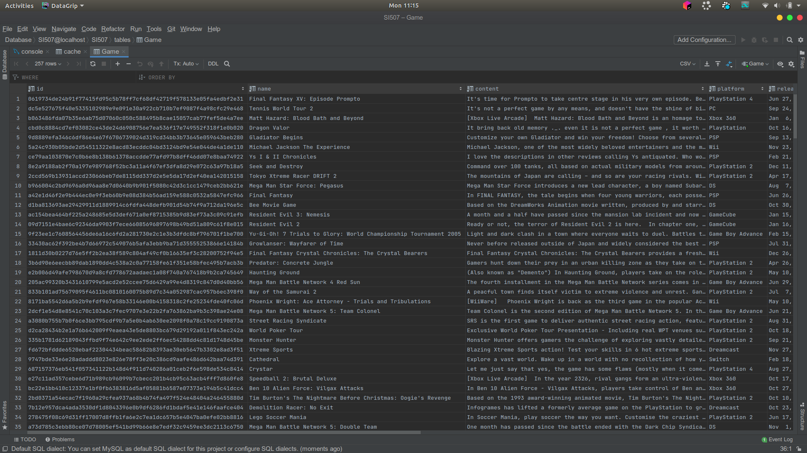
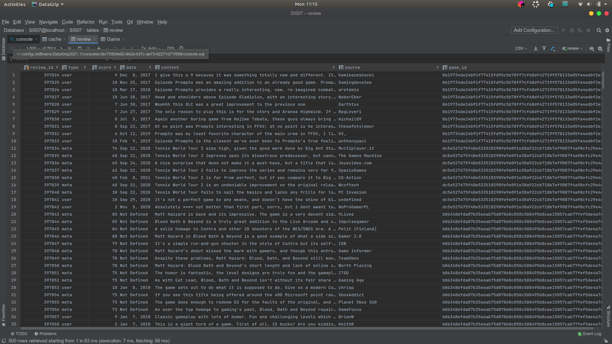
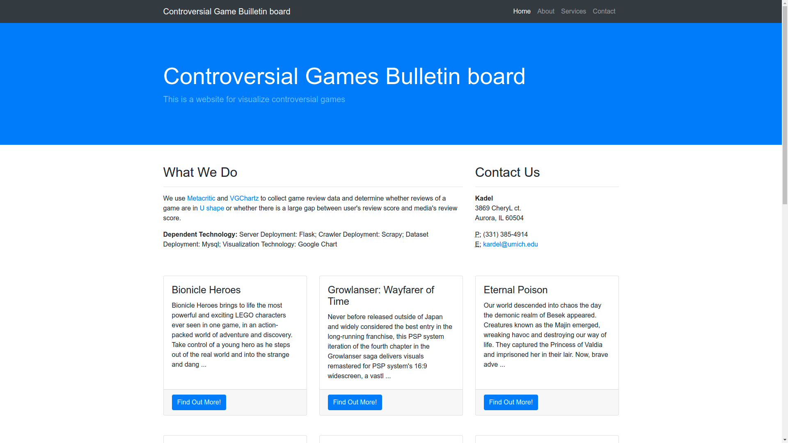
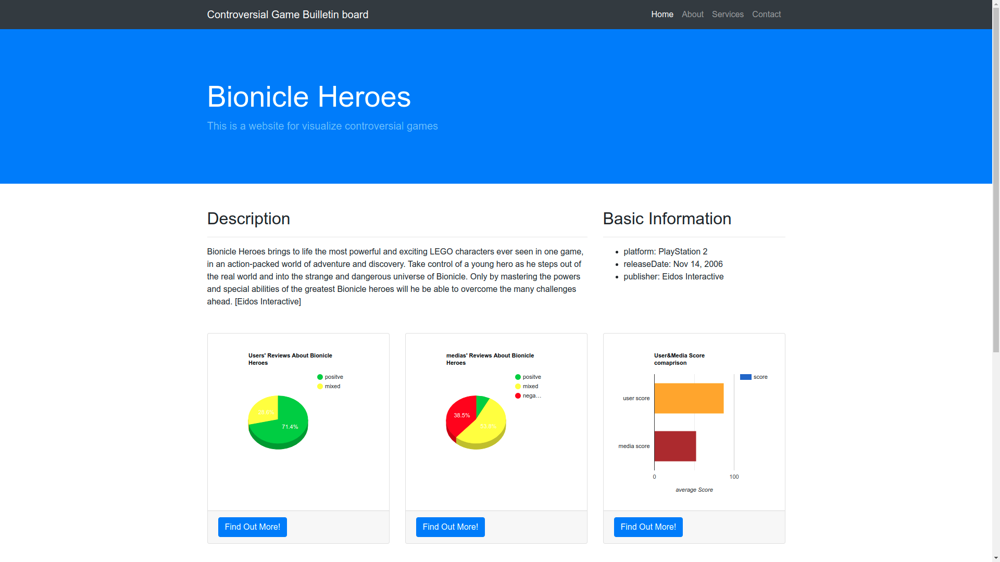
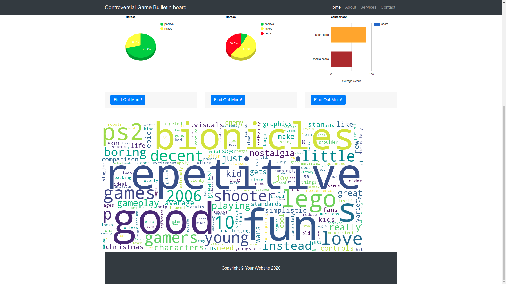

# README

## Introduction

This project is a Flask& MySQL-based project to represents controversial games on [Metacritic](https://www.metacritic.com/)


## Data Source

### Target Description

origin: Metacritic, which is a game\&movie review website containing users' review and medias' reivew. 
The entry of my crawler is a specific website. [Entry](https://www.metacritic.com/browse/games/score/userscore/all/filtered). This entry is a specific that lists all games in all platforms. I can iterate all pages sequentially. 

But according to my experience, It will interrupt your connection after your 45-70 times access randomly. According to my hypothesis, I don't Metacritic has any algorithm to defend crawlers. Instead, it is just because of intensity access from my IP. So for convenience, I only crawl the first 30 pages, which contains 3000 game pages (Example: [Example Page](https://www.metacritic.com/game/pc/the-witcher-3-wild-hunt)).

### Format

I get the phrases from these game pages and directly save it into MySQL. So the format is MySQL. 

I have two tables for entities: Game and Review. Game denotes to a game and Review denotes to a review corresponding to the game. 

Game contains 13 properties: id, name, content, platform, release date, publishers, user score, meta score, user\_positive, user\_mixed, user\_negative, meta\_positive, meta\_mixed, meta\_negative. id is the identifier of a game. For convenience, I take SHA256 Hash of the concatenation of name, platform, release date as id. name, content, platform, release date and publishers are the basic information of a game. Besides, user score and meta score are the average users' review score and the average medias' review score. user\_positive, user\_mixed, user\_negative, meta\_positive, meta\_mixed, meta\_negative are the number of positive, neutral and negative reviews given by users and medias.

Review contains 6 properties: type, score, date, content, source and game id. type is *user* or *meta*, meaning the review is from a user or from a media. Score is the review score. source is the name of reviewer. Content is the content of the review and game id is which game the review is corresponding to.

## Access Methods

I use *scrapy* to access the methods, which is a classic python web crawler.  framework. It allows multi-thread web crawling so I set 8 crawlers. The default value is 16 but in practice, 16 crawlers will cause web scraping failure, so I decrease the number of crawlers.

Thanks for being an old website, Metacritic is a static website that doesn't use AJAX to update data items and doesn't have any defence for crawler. It could benefit me while it creates many troubles to me. I don't need to parse JSON data from website and I can directly fetch information from the website. But for some hot games, like [*The last of Us Part II*](https://www.metacritic.com/game/playstation-4/the-last-of-us-part-ii) which contains more than 70,000 reviews, it may cause that I cannot get correct reviews after numerous refreshing. So I use different strategies on "high load" and "low load" games' reviews pages. If the a game has less than 3000 reviews, it is regarded as "low load" page, so fetching all reviews works fine. But for a game that has more than 3000 reviews, only at most the first 1000 positive, neutral and negative reviews will be fetched (entries: [Positive Reviews](https://www.metacritic.com/game/playstation-4/the-last-of-us-part-ii/user-reviews?dist=positive), [Neural Reviews](https://www.metacritic.com/game/playstation-4/the-last-of-us-part-ii/user-reviews?dist=neutral), [Negative Reviews](https://www.metacritic.com/game/playstation-4/the-last-of-us-part-ii/user-reviews?dist=negative)
). This strategy can mitigate the storage pressure and the risk of getting wrong reviews. 

### Cache

I create a table *cache* for caching. Every time I try to crawl on the game page, I will look up *cache* table. If it contains the game id, then ignore the game page. Otherwise we crawl on the game page and add the game id into *cache* table.


## Database

Database schema

```mysql
CREATE TABLE `review` (
    review_id INT NOT NULL AUTO_INCREMENT PRIMARY KEY,
    type VARCHAR(10) NOT NULL,
    score DOUBLE NOT NULL,
    date VARCHAR(30) NOT NULL,
    content MEDIUMTEXT NOT NULL,
    source VARCHAR(100) NOT NULL,
    game_id VARCHAR(1024) NOT NULL
);
CREATE TABLE `Game` (
    id VARCHAR(1024) NOT NULL PRIMARY KEY,
    name varchar(128) NOT NULL,
    content MEDIUMTEXT NOT NULL,
    platform VARCHAR(512) NOT NULL,
    releaseDate VARCHAR(128) NOT NULL,
    publisher VARCHAR(512) NOT NULL,
    userScore DOUBLE NOT NULL,
    metaScore INT NOT NULL,
    user_positive INT NOT NULL,
    user_mixed INT NOT NULL,
    user_negative INT NOT NULL,
    meta_positive INT NOT NULL,
    meta_mixed INT NOT NULL,
    meta_negative INT NOT NULL
)

CREATE TABLE cache(
    id VARCHAR(1024) NOT NULL 
)
```

There is a "logical" foreign key in table review *game\_id*, which is related to table Game's primary key. I didn't declare it as foreign key is because of bad efficiency of foreign key. 




## Interaction and Presentation Plans

### Overview

I plan to use a FLask-based Website for the Presentation and Interaction. 

I will use a bootstrap-based template. Here is the link: [Bootstrap Page](https://startbootstrap.com/template/business-frontpage)

For beauty I only list 12 games on the homepage，there is an AJAX "read more" button to load more games. It lists all controversial games. By clicking each games, it  redirects to another website game details. I plan to use google Chart for plotting ratio among number of positive reviews, number of neutral reviews and number of negative reviews. Also, I plan to use wordCloud python library for word cloud. I plan to save a word cloud in a temporary PNG image then read it as BASE64. then use base64 image for using the word cloud.

### Technology Stack

- **back-end**: Flask, WordCloud, mysql.connector, JInjia2
- **front-end**: Bootstrap, Jquery, Google Charts
  Frankly speaking I have done a version of presentation. Here is the screenshot: 
  
  
  

## Executing Instruction

Here is a detailed executing instruction.
In the root folder SI507Final, run command

```bash
scrapy crawl all_games -a start_page=1 -a end_page=30
```


where start\_page and end\_page is the starting page index and ending page index of [Main Entry](https://www.metacritic.com/browse/games/score/userscore/all/filtered).


Then run 

```sh
cd flaskProject
flask run
```

